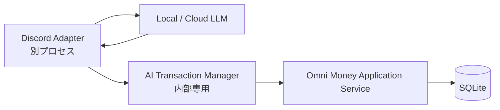

# AI連携・Discordレシート登録ロードマップ

## 1. 目的

最終目標は、Discordなどへ投稿されたレシート画像をローカルLLMまたはクラウドLLMで読み取り、Omni Moneyへ安全に画像付き取引として登録することです。

LLMの出力は正しいとは限りません。AI専用入口はLLMの候補値をそのままDBへ流さず、アプリケーション側の検証を通してから登録します。既存データの編集、削除、設定変更、CSVインポート、スナップショット復元はAIへ許可しません。

## 2. 現在の実装

現在のAI専用入口は、公開Webと同じGoプロセス内にある別HTTPリスナーです。独立したマネージャープロセスではありません。

| 項目 | 現在の状態 |
| --- | --- |
| AI待受 | 既定 `127.0.0.1:4001` |
| 認証 | 32文字以上のBearer token |
| 取引追加 | `POST /api/v1/ai/transactions` |
| 分析 | `POST /api/v1/ai/analysis` |
| 編集・削除 | ルートを提供せず、POST以外は拒否 |
| 公開Webとの分離 | 公開Webの4000番にはAIルートを登録しない |
| AI専用入力検証 | 必須項目、種類、正の金額、日付範囲を検証 |
| 日付範囲 | サーバーの今日を基準に1年前から2日後まで（両端を含む） |
| タグ | IDの存在確認と重複排除を行い、未知IDを拒否 |
| 画像 | Base64、ファイル名、対応MIMEを事前検証してから追加 |
| 管理UI | セッション認証済みWebからサーバー内部でAI専用リスナーへ固定中継 |

AI経由の追加は可能ですが、変更と削除はできません。通常の人間向け取引画面にはAI専用の日付範囲制限を適用しません。

## 3. 推奨する責務分離

- Discord AdapterはDiscordイベント、添付ファイル取得、再試行、結果返信を担当します。
- LLMは画像から構造化された取引候補を生成します。DBやOmni Moneyの認証情報は持ちません。
- AI Transaction Managerは候補値の検証、正規化、重複防止、監査を担当します。
- Omni Money Application ServiceだけがSQLiteを書き込みます。
- Discord Adapter、LLM、ManagerへSQLiteファイルをマウントしません。

クラウドLLMを使う場合も、クラウド側から自宅へ着信させません。ローカルのAdapterがクラウドAPIへ発信して構造化結果を受け取り、内部のManagerへ渡します。

## 4. AI Transaction Managerの将来API

すべてPOSTとし、パスとtoken scopeを明示的に許可します。

| API案 | 用途 |
| --- | --- |
| `POST /api/v1/ai/context` | 口座、タグIDと階層、取引種別、タイムゾーン、日付範囲、画像制限、schema versionを返す |
| `POST /api/v1/ai/transactions/validate` | DBへ書き込まず、候補値の正規化結果とエラーを返す |
| `POST /api/v1/ai/transactions` | 検証済み取引を原子的に追加する |
| `POST /api/v1/ai/analysis` | 条件に一致する取引を分析する |

`context` はLLMが `現金`、`銀行口座` などの既存口座やタグを知るために使います。取引明細は返しません。新しい口座名をAIが自由に作ることは既定で許可せず、現在の候補から選ばせます。

## 5. 入力検証ポリシー

AI入力はJSON Schemaに合っていても信用せず、サーバー側で再検証します。

### 現在実装する検証

- `account`、`date`、`item`、`type`、`amount`を必須とする
- 前後の空白を除去する
- `type` は `income` または `expense` のみ
- `amount` は正整数のみ
- `date` は `YYYY-MM-DD` のみ
- サーバーの今日を基準に、1年前から2日後までを許可する
- `time` を指定する場合は `HH:MM` とする
- タグIDの存在確認と重複排除を行い、未知IDを拒否する
- 画像のBase64、ファイル名、JPEG/PNG/GIF/WebPの宣言MIMEを検証する

### 次段階で追加する検証

- `account` はcontextが返した既存値だけを許可する
- 文字数、画像枚数、画像1枚と合計のバイト数に上限を設ける
- Base64を厳密に復号し、JPEG/PNG/GIF/WebPのmagic bytesと宣言MIMEを照合する
- 取引、画像、タグ、残高再計算を1つのDB transactionで実行する
- 画像やタグの1件でも失敗した場合は全体をrollbackする
- `Idempotency-Key` を必須にし、Discordの再送で同じ取引を重複登録しない

## 6. 画像の受け渡し

MVPでは既存APIと互換性のあるBase64方式を使います。

1. Discord AdapterがDiscord CDNから画像を取得します。
2. Content-Type、ダウンロード上限、timeoutを確認します。
3. 必要であればAdapter専用の一時ディレクトリへ権限 `0600` で保存します。
4. Base64へ変換し、`images` 配列としてManagerへ送ります。
5. 成功・失敗にかかわらず一時ファイルを即時削除します。

Managerへ任意のファイルパスや任意URLを渡す方式は採用しません。パストラバーサルやSSRFの入口になるためです。Manager側で一時ファイルが必要な場合は `os.CreateTemp` と専用tmpfsを使い、TTL付き清掃処理を設けます。

Base64は元データより約33%大きくなるため、現在のHTTP body上限10MiBを踏まえて画像上限を決定します。大容量化が必要になった段階でmultipartまたは内部オブジェクト参照を検討します。

## 7. Discord処理フロー

1. Discord Adapterがイベントを受信し、署名とbot tokenを検証します。
2. レシート添付を上限・timeout付きで取得します。
3. 選択されたローカルLLMまたはクラウドLLMへ画像を送り、構造化候補を生成します。
4. Managerのcontextと候補値を照合します。
5. validate APIでサーバー側検証を行います。
6. 信頼度が低い、日付や金額が曖昧、未知口座がある場合は登録せず人間確認待ちにします。
7. `discord:<message_id>:<attachment_id>` 形式のIdempotency-Keyで追加します。
8. Discordへ取引IDまたは要確認理由を返信します。

レシート内の文字列にはprompt injectionが含まれる可能性があります。LLMへ汎用的なtool実行権限を与えず、構造化出力だけを許可します。

## 8. UIからの操作

サーバーモードの「AI API操作」画面は、通常のセッション認証を通過したリクエストだけを受けます。ブラウザはAI用Bearer tokenや接続先を保持しません。公開Webサーバーが固定された2操作だけをloopbackのAI専用リスナーへ転送します。

この管理画面はAPI契約の確認と手動入力用です。LLM providerのAPIキーを入力する画面ではありません。ローカル/クラウドLLM連携は別プロセスのAdapterから行います。

## 9. セキュリティと監査

- client別token、最小scope、rotation、revokeを導入する
- token単位のrate limitを設ける
- request ID、client ID、日時、検証結果、transaction IDを監査ログへ残す
- token、provider key、Base64画像、レシート全文はログへ残さない
- クラウドLLMへ画像を送る場合はUIで明示し、利用者のopt-inを必須にする
- Manager障害時にDB直接書き込みへfallbackしない
- Dockerでは最終的にManagerをprivate networkのみに置き、host portsを公開しない

## 10. 段階的な実装計画

1. AI分析の全フィルター整合と回帰テスト
2. AI専用の日付・必須項目検証と管理UI
3. context、validate、atomic create、Idempotency-Key、画像厳格検証
4. Discord Adapterを別プロセスとして追加し、人間確認フローを実装
5. AI Transaction Managerを別プロセス/別コンテナへ抽出し、private networkまたはUnix domain socketへ移行

## 11. 受入テスト

- 今日の1年前と2日後は登録でき、その1日外側は拒否される
- AIで必須項目不足、未知口座、未知タグ、壊れた画像を拒否する
- 同じIdempotency-Keyでは1件だけ登録される
- AIポートのPUT/DELETEは拒否される
- 公開WebポートのAIパスは利用できない
- AIポートの通常API、ログイン、静的ファイルは利用できない
- ManagerポートへLAN/インターネットから到達できない
- ブラウザbundle、localStorage、ログへ秘密情報が入らない
